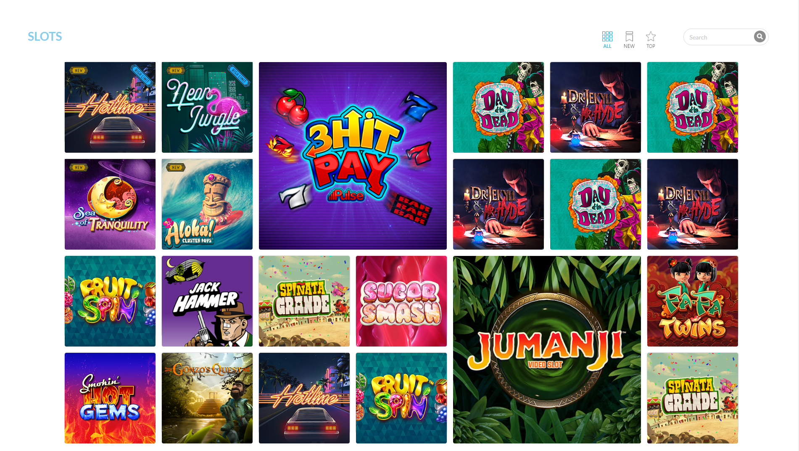

# Slots Of Fun

## **Abstract:**

Create an online gaming platform.

## **Installation Instructions:**

Open Your Terminal

### Copy and paste the following lines below into your terminal:

```bash
git clone https://github.com/GregGains/SlotsofFun
```

```bash
cd SlotsOfFun/
```

```bash
npm install
```

```bash
npm start
```

## **Project Goals:**

- Create a user friendly and responsive gaming experience.
- Implement the project using React & TypeScript.

## **Main View:**


